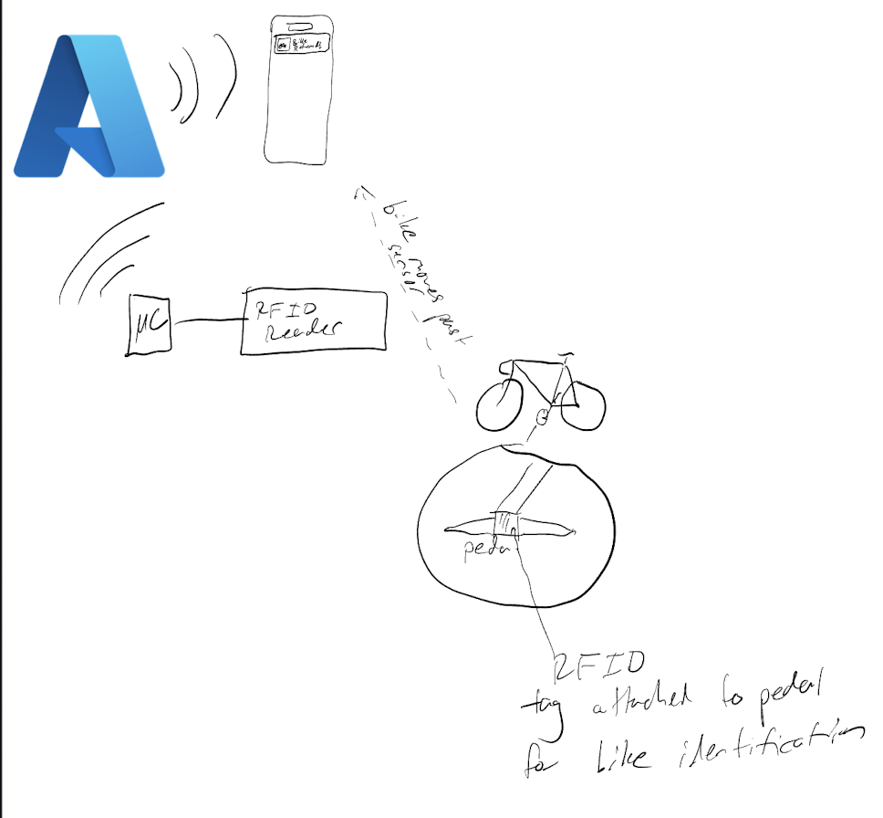
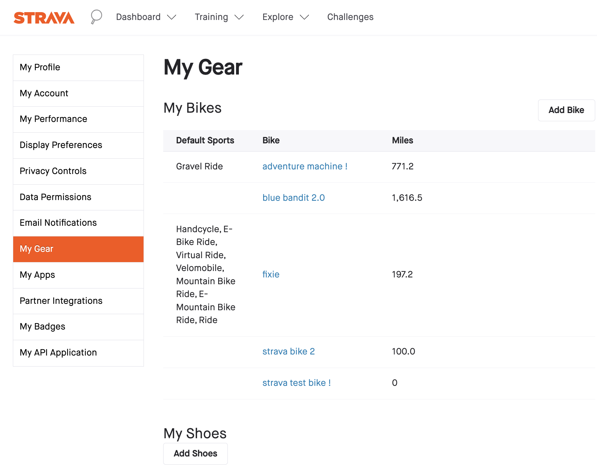
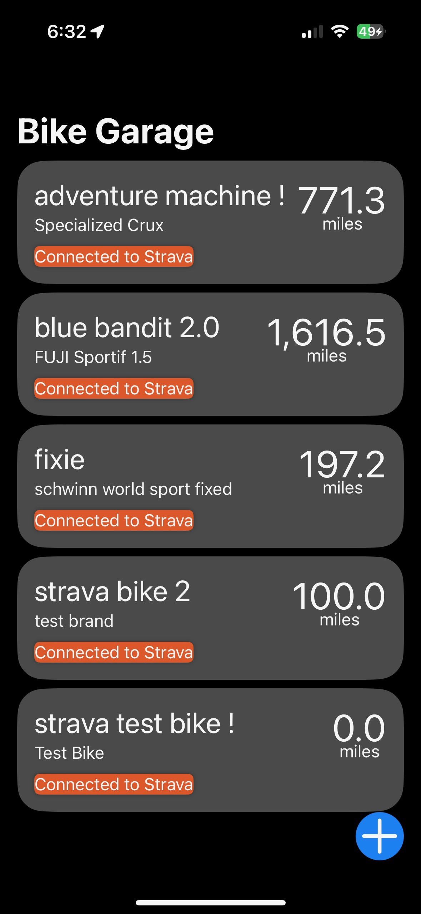
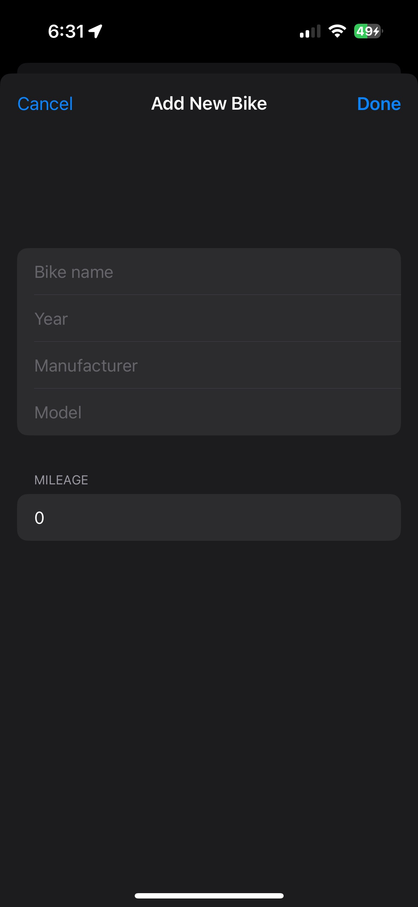
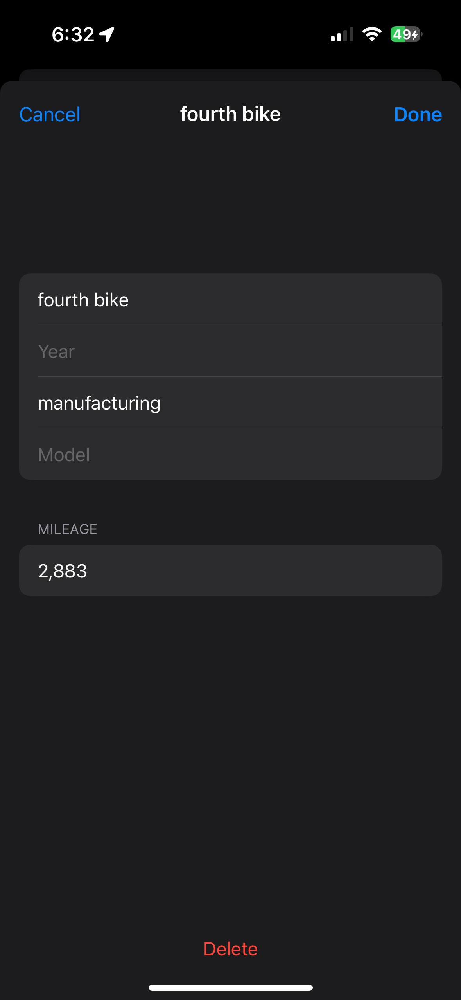
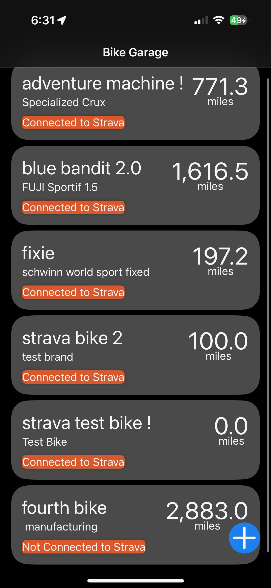
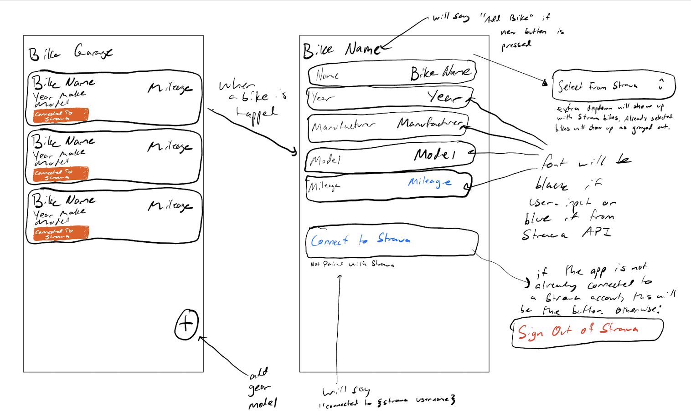
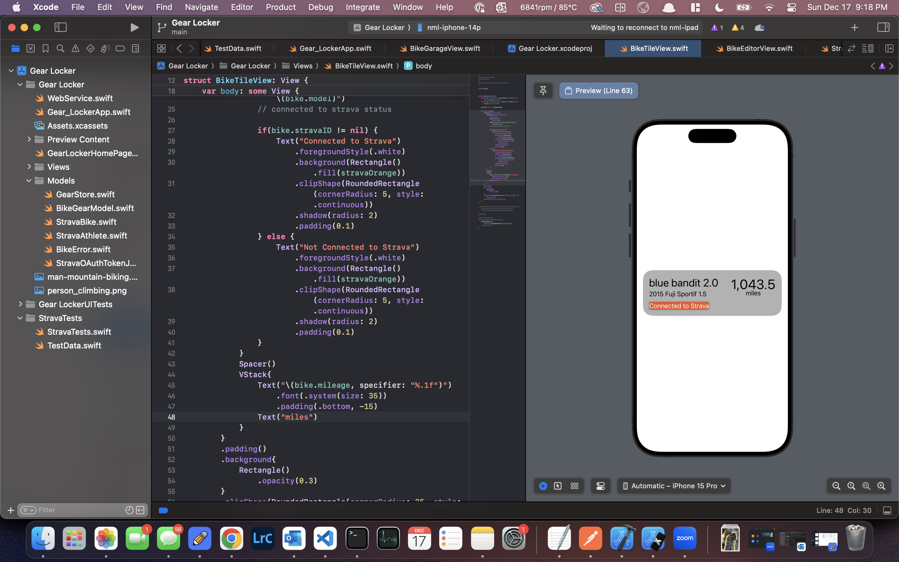

# Gear Locker/Bike Journal/Gear Journal/Name WIP
#### Noah Lichstein - Fall 2023
This is the repository containing my ECE 1895 Junior Design Fundamentals Final Project for the 2023-2024 academic year.

My main objectives for this project were to a) learn a new skill and b) combine my love for bikes and climbing into my ECE-related project. I achieved such objectives by creating an iOS application to keep track of my bicycles - the distance ridden on them, the make/model/years - a centralized repository of data to have as an easy reference. It's handy to know the mileage on a bicycle for resale and component replacement/maintanence. [Strava.com](strava.com) keeps track of mileage for bikes that get assigned to rides, however for example, with my commuter bike, I don't log those rides on Strava and I have to go off of a guess. Now I can log this in my app and have the data handy whenever I need it.

My original motivation for this app was going to be as a companion app to a device that detects which bike I come home with and automatically sets the Strava activities since leaving the house with that bike to that bicycle. Below is a diagram highlighting how that system would work. <div style="text-align:center"><p><em>Block design of orignal hardware design</em></p></div>

Shortly into verifying my prelimiary design for the bike detection device, I realized that designing the RFID system with enough range to detect a bike from ~1 meter away in less than 6 weeks was more than a stretch goal, and that I probably wouldn't be able to complete that within the project timespan. I then decided to pivot the scope of my project to the iOS app, so that I could still do something related to the original project but also stay true to my goal to learn something new which was iOS app development.

While I already had some UI-oriented work experience from when I was a full-stack software engineer, I had never created designs myself nor had I implemented any designs in an iOS app using SwiftUI. Learning SwiftUI and how to make iOS apps has been a long time goal of mine, and this project seemed like a great way to both spend some time learning a new language and framework and put what I've learned to use.

# Preliminary Exploration and Verification
When I was still planning on the hardware implementation of my bike detector, my exploration phase was entirely research-based. I first considered induction loops before realizing that NFC/RFID tags would be the best way to identify and differentiate different bikes without using a camera-based implementation, which I wanted to avoid as I would be placing this device in my home, and I wanted to protect my housemates' and my privacy.

Once I pivoted to the SwiftUI app, I first began running through some SwiftUI tutorials, specifically Apple's [Getting Started With Scrumdinger](https://developer.apple.com/tutorials/app-dev-training/getting-started-with-scrumdinger) and [Gettting Started with SwiftUI](https://developer.apple.com/tutorials/swiftui/creating-and-combining-views) tutorials. I'd follow through the tutorials but instead of implementing the code in the tutorials, adapt what I was learning and gear it towards my app.

In addition to getting started with the Swift language and SwiftUI framework, I researched the Strava API to determine the scope of features I could implement in my app. My original plan was for the app to be a live twin of the "My Gear" section of Strava.com (screenshot below) plus any bikes that the user wants to add themself.
<div style="text-align:center"><p><em>The My Gear page on Strava.com</em></p></div>

My exploration of the [Strava API](https://developers.strava.com) started with reading through the API documentation and then creating API credentials to start testing API calls with. I requested a client id and client secret from strava, then started working through the OAuth 2.0 authentication protocols so I could test the API endpoints that were relevant to my project.

## API Preliminary Testing
I conducted the preliminary API testing using the Postman app to make HTTP requests.

### OAuth Process
I first needed to authenticate my API session. The Strava API uses OAuth 2.0 to handle authentication. With OAuth 2.0, a client uses the client id and client secret to request a code, which is then used to make an OAuth request to the API to request an access token with specific scope permissions. This access token lasts for 5 hours and is used to authenticate further requests. Because my applcation mostly dealt with an athlete's profile and gear, I needed the `read_all` and `profile:read_all` permissions. This allowed for my app to get private athlete data.

I followed along with an article I found (https://jessicasalbert.medium.com/holding-your-hand-through-stravas-api-e642d15695f2) to get through the authentication process. 

Once I got an access token (no screenshots included for account privacy reasons), I was able to start testing the athlete get and Get Gear by id endpoints.

### Athlete Get
Link to Strava docs: https://developers.strava.com/docs/reference/#api-Athletes-getLoggedInAthlete

I wanted to use this endpoint so that once the app had a user's refresh token, I could get the list of bicycles associated with their account. An example of the response from Strava's API docs is shown below:

```json
{
  "id" : 1234567890987654321,
  "username" : "marianne_t",
  "resource_state" : 3,
  "firstname" : "Marianne",
  "lastname" : "Teutenberg",
  "city" : "San Francisco",
  "state" : "CA",
  "country" : "US",
  "sex" : "F",
  "premium" : true,
  "created_at" : "2017-11-14T02:30:05Z",
  "updated_at" : "2018-02-06T19:32:20Z",
  "badge_type_id" : 4,
  "profile_medium" : "https://xxxxxx.cloudfront.net/pictures/athletes/123456789/123456789/2/medium.jpg",
  "profile" : "https://xxxxx.cloudfront.net/pictures/athletes/123456789/123456789/2/large.jpg",
  "friend" : null,
  "follower" : null,
  "follower_count" : 5,
  "friend_count" : 5,
  "mutual_friend_count" : 0,
  "athlete_type" : 1,
  "date_preference" : "%m/%d/%Y",
  "measurement_preference" : "feet",
  "clubs" : [ ],
  "ftp" : null,
  "weight" : 0,
  "bikes" : [ {
    "id" : "b12345678987655",
    "primary" : true,
    "name" : "EMC",
    "resource_state" : 2,
    "distance" : 0
  } ],
  "shoes" : [ {
    "id" : "g12345678987655",
    "primary" : true,
    "name" : "adidas",
    "resource_state" : 2,
    "distance" : 4904
  } ]
}
```
<em>https://strava.com/api/v3/athlete?access_token={access_token}</em>


Note the `bikes` member of the JSON object returned. The `bikes.id` members returned will be used in the next call.

### Get Gear by Id
Link to Strava docs: https://developers.strava.com/docs/reference/#api-Gears

After obtaining the bike ids in my profile, I made a call to the get gear by id endpoint. I was able to verify that using a valid access token and bike id, I was able to get the full JSON object of bike data needed for my app.

## SwiftUI-specific testing
Seperate from the API testing and integration, I wanted to make sure that all of the user interactivity and data displaying I wanted to include in my app was feasible and doable. I started building out different view models to display data and researched the UI elements that I wanted to include, such as scene changing, pull to refresh, and turning views into buttons. I also used this opportunity to start on app development as I explored these different SwiftUI mechanisms. 

One important thing I wanted in my app was persistence so when the app closed, the data could persist and be saved for when the app was open. I followed through an Apple tutorial (part of the previously linked Getting Started with Swift tutorial) to learn how to implement this.

# Implementation

My design is a one-page iOS mobile application that displays a user's list of Strava-tracked bicycles followed by a list of user-input bicycles in the app. Each bike is displayed with a name, the make, model year of the bike, and the mileage ridden.

The list of bikes conncected to Strava is automatically pulled from a user's Strava profile. The list and data in the list is refreshed each time the app is opened and each time the user pulls the list down from the top (think email refresh gesture). The user-input bikes are editable as well. When a user taps on one of the bikes with a "Not connected to Strava" label, the user can change any of the attributes of the bike, including adjusting the mileage. The user can add new bikes with the "+" button in the bottom right corner of the app, and delete bikes by tapping the "delete" button when in the editing view of a bike.

## Application Screenshots

<div style="text-align:center">

<p><em>The home screen of the app. This is before any user-added bikes have been added.</em></p>
</div>

<div style="text-align:center">

<p><em>The new bike modal. This sheet pops up over the list of bikes when the "+" button is tapped.</em></p>
</div>

<div style="text-align:center">

<p><em>The edit bike modal. Note the difference in navigation title from the new bike modal; here, the top of the screen says the bike's name opposed to "Add New Bike"</em></p>
</div>

<div style="text-align:center">

<p><em>When more bikes are saved/pulled from Strava than can fit on the screen, the user can scroll through the list of bikes. This also demonstrates the Connected to Strava vs. Not Connected to Strava labels.</em></p>
</div>

## Views List
This section details the different views that make up the application.

### [BikeGarageView.swift](Gear%20Locker/Views/BikeGarageView.swift)
This view uses a `ForEach` loop to parse through the list of Strava bikes and the list of user-added bikes. It also controls the edit/new bike sheet appearing/dissapearing. This view also holds the code I wrote to fetch data from the Strava API. 

### [BikeEditorView.swift](Gear%20Locker/Views/BikeEditorView.swift)
This view contains the text fields for user input to edit/add a new bike. The model takes a binding to a [BikeGearModel](Gear%20Locker/Models/BikeGearModel.swift). If the input BikeGearModel is empty, the text fields will be empty. If not empty, the text fields will contain the data already stored in the model for editing. BikeGarageView handles the saving of data edited in this model.

### [BikeTileView.swift](Gear%20Locker/Views/BikeTileView.swift)
This view displays the data stored in a BikeGearModel for a bike not connected to Strava. The label is fixed to "Not Connected to Strava"

### [StravaBikeTileView.swift](Gear%20Locker/views/StravaBikeTileView.swift)
This view displays the data fetched from Strava for a bike from Strava. This model was built from BikeTileView, except does not display the year field of BikeGearModel and the label displays "Connected to Strava"

## Models List
This section details the data models that make up the application.
### [GearStore.swift](Gear%20Locker/Models/GearStore.swift)
This class contains an array of BikeGearModels that are stored locally in the app. There is a method to load and save a JSON file of BikeGearModels to the phone's storage. This allows for data persistency between app close and open.

### [BikeGearModel.swift](Gear%20Locker/Models/BikeGearModel.swift)
This structure holds the user-input bike information presented in a bike tile as well as a UUID to make each bike distinguishable with one identifier. This structure has an extension empty bike for initializing new bikes.

### [StravaAthlete.swift](Gear%20Locker/Models/StravaAthlete.swift)
This structure decodes the response from a GET request from `https://strava.com/api/v3/athlete?access_token={TOKEN}`. It most importantly for the purposes of this app holds an array of bike ids decoded from the request.

### [StravaBike.swift](Gear%20Locker/Models/StravaBike.swift)
This structure decodes the reponse from a GET request from `https://strava.com/api/v3/gear/{ID}?access_token={TOKEN}`. It holds the data passed to a StravaBikeTileView for displaying the bikes fetched from Strava.

All other models included are for HTTP request error reporting or future developments of the application. See [Conclusion and Future Work](#Conclusion-and-Future-Work) for more information.

## Application design
The application currently relies on a hard-coded access token from Strava (see [OAuth Process](#oauth-process) for more details). The app uses that hard-coded access token to make all requests to Strava on behalf of the user. This is in lieu of having a sign-in process. 

When the application opens, the bike list from Strava is refreshed and displayed followed by the list of user-input bikes that are loaded on app launch. Whenever the user refreshes the list of bikes, the list is re-fetched from Strava as well. Whenever the app goes inactive, the locally saved bikes are re-saved to storage.

## Engineering Process and Design Practices
After my initial first views were implemented to verify that my high level concepts would work as an iOS application, I storyboarded what the app would look like. Below are my storyboard drawings.

<div style="text-align:center">

<p><em>Application Storyboard. Bike List (left) and edit model (right).</em></p>
</div>

After storyboarding/drawing, I started the rest of development. I came up with a list of tasks that needed to be completed for the app to be ready for project delivery, and I logged them in [GitHub issues](https://github.com/fletch2001/ece1895-gearjournal/issues). 

When developing code, I used the Xcode Canvas feature to preview the views I was building as I coded them. Below is a screenshot of how I set my editor up while developing views.

<div style="text-align:center">

<p><em>View code (left) and live preview (right).</em></p>
</div>

When developing views, I'd generate sample data; either as an extension of a model or in-line with the preview generation code in order to test my view as I developed it. Once the view was ready to integrate with other views, I'd continue to use the preview the parent views to integrate with more sample data.

When developing the HTTP fetch code, I used unit test driven development to verify that my JSON decoding/encoding code worked correctly before integrating.

# Testing
When I completed my initial round of development, before integrating with the Strava API, I tested using the Simulator MacOS app bundled with Xcode. I verified that the data persistency worked correctly and it did with no issues.

Once I integrated the Strava API code, I pivoted to testing using my own phone. 

I had to consult an online article [https://codewithchris.com/deploy-your-app-on-an-iphone/](https://codewithchris.com/deploy-your-app-on-an-iphone/) because I couldn't figure out how to deploy my app to my phone only based on Apple's documentation. Once I deployed the app, I tried running it and it froze. I plugged my phone into my computer and launched the debugger; running the app on my phone and feeding the debug information back to Xcode. I realized that the app was throwing a SIGSEGV, but I couldn't figure out where. I started adding breakpoints before where I was making HTTP requests to determine if the requests were even being made or not. After reaching the breakpoint, I stepped through my code line-by-line to realize that the app was crashing after the HTTP request completed and the code attempted to parse through the HTTP response. 

The error was being caused due to an extra `http://` (from a copy/paste error) in front of the request url. After removing the extraneous address start, the code worked flawlessly and I was able to see the list of bicycles saved in my Strava account.

### Strava API Testing
Once I verified that the data fetch worked correctly, I started changing data on Strava.com to make sure that it reflected in the application. I was able to positvely verify that the app always reflected what was on the My Gear page on Strava.com, as intended.

Link to video demonstration of application: https://www.youtube.com/watch?v=w9LudFBB278

# Conclusion and Future Work
I'm very happy with the outcome of this project. After having to change the scope of my due to constrained parts ordering times and not enough time to design custom RFID antennae, I still have met my original goals of learning a new language/framework/skill and I got to design something in line with my interests. My app fully functions as anticipated and originally designed, and the integration with the Strava API works.

I want to expand the functionality of my app to store climbing gear as well. The basis is already written; the GearStore, the tile views, and the data models; they just need to be tweaked to be specific for climbing gear. I've started a new app home page, which has a tab switcher between bike and climbing gear ([GearLockerHomePage.swift](Gear%20Locker/GearLockerHomePageView.swift)).

I'd also like to integrate a Strava sign in into my app so that the access token doesn't need to be hardcoded before building and deploying. With this method, the app only works for 5 hours before needing to be redeployed with a new access token. 

I'd like to eventually implement the hardware version of the bike detector, and integrate the app with it.

Overall, I'm really happy with the outcome of this project, and I'm excited to use my new Swift skills towards future ECE projects; especially for making mobile embedded device companion apps/dashboards.